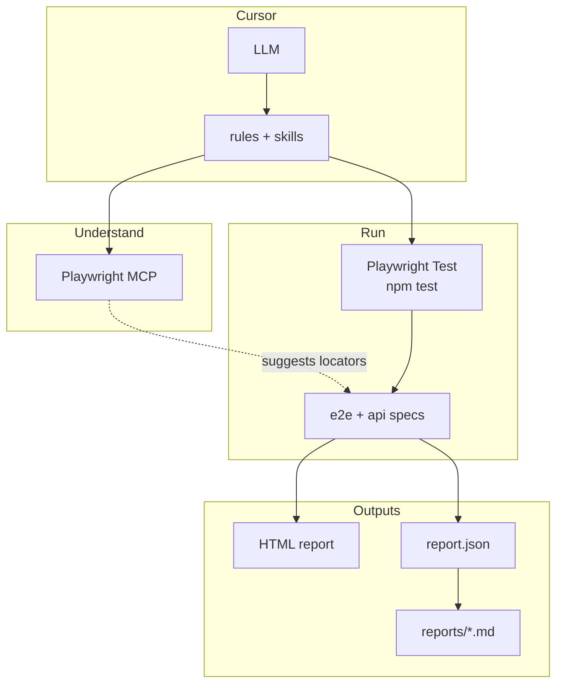
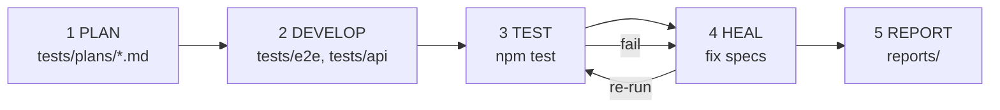
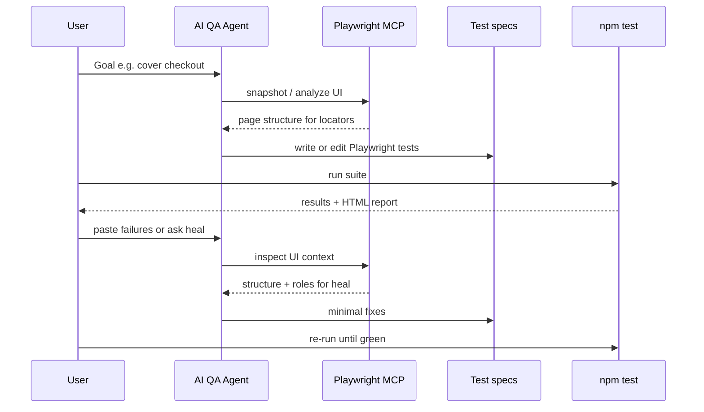

# AI QA Agent (TestAgentDemo) — Cursor + Playwright

[](https://github.com/loveautomate/ai-qa-agent/actions/workflows/playwright.yml)

**MCP + rules** for understanding and planning · **`npm test`** for all automation · **Workflow:** PLAN → DEVELOP → TEST → HEAL → REPORT

**Docs:** [`docs/`](docs/) · [`AGENTS.md`](AGENTS.md) · [`PRD.md`](PRD.md) · [`TASKS.md`](TASKS.md) · [`BRANCHING.md`](BRANCHING.md)

---

## Architecture and flows

Understanding (MCP in Cursor) vs execution (Playwright Test only). Optional terminal tool **`playwright-cli`** is documented below—not part of the default sequence diagram. Sources: [`docs/architecture.md`](docs/architecture.md), [`docs/flows.md`](docs/flows.md).

### System layers



### Five-phase loop



### Typical iteration (sequence)

Default path in Cursor: **MCP** for understanding, **Playwright Test** for execution. (`playwright-cli` is optional; see next subsection.)



*Snapshot text above is plain language. MCP often returns the **accessibility tree** (roles/names)—sometimes abbreviated **a11y** (“**a**ccessibilit**y**”, 11 letters). That helps pick stable `getByRole` locators.*

### MCP vs `playwright-cli` vs Playwright Test

**Run your suite (execution):** always **`npx playwright test`** from **`@playwright/test`** (`npm test`). That is what CI and this repo use. Do **not** substitute **`playwright-cli`** here—it is a different package for **terminal browser control** (open, click, snapshot, …), not for running `*.spec.ts` as your automated test run.

| | What it is | Role in this repo |
|---|------------|-------------------|
| **Playwright Test** | `npm test` / `npx playwright test` (`@playwright/test`) | **Only** way to **execute** committed UI/API tests. **Flakes** are reduced in **spec code** and config—retries, locators, waits—not by switching MCP vs CLI. |
| **Playwright MCP** | Cursor server `playwright-test/*` ([`.vscode/mcp.json`](.vscode/mcp.json)) | **Understanding** in the IDE: snapshots, navigate, network. Fits **chatmodes** and rich inspection; responses can be **large** in the chat context. |
| **`@playwright/cli` (`playwright-cli`)** | Separate **terminal** app ([coding-agents docs](https://playwright.dev/docs/getting-started-cli)) | **Optional** for **exploration** (shell-driven browser, snapshots on disk). **Not** your test runner. Token use vs MCP **varies** by how you prompt and what you paste back—don’t assume it is always cheaper; use it when a **terminal-first** flow fits. |

**Installed skills** (`.agents/skills/playwright-cli/`, `npm run playwright:skills`): **documentation** for `playwright-cli` **if** you use it. They do **not** replace MCP, do **not** execute `npm test`, and are **not** required to author or run Playwright Test specs.

**Scenarios**

- **Default (this repo)** — Understand with **MCP**; implement **`tests/**/*.spec.ts`**; **execute** with **`npm test`**.
- **Terminal exploration** — Use **`playwright-cli`** only if you want shell-driven browsing; still **encode** behavior in specs and **run** with **`npm test`**.
- **Both** — MCP plus occasional CLI is fine; **execution** of the suite remains **`npx playwright test`**.

---

## `main`, a feature branch, and prompts

| Step | What to do |
|------|------------|
| 1. Base | Stay on **`main`** for the shared template (rules, config, seed test, empty `tests/e2e` / `tests/api` placeholders). |
| 2. Branch | `git checkout main && git pull && git checkout -b feature/<name>` — add **your** plans and specs on this branch, not on `main` if you want a clean fork of the framework. |
| 3. Plan | In Cursor, @-mention or paste **[`.cursor/prompts/plan.prompt.md`](.cursor/prompts/plan.prompt.md)** and describe the URL/API → produce **`tests/plans/<something>.md`**. |
| 4. Implement | Ask the agent to follow **[`.cursor/rules/00-orchestrator.mdc`](.cursor/rules/00-orchestrator.mdc)** (PLAN → DEVELOP → …) and add **`tests/e2e/*.spec.ts`** or **`tests/api/*.spec.ts`**. All real actions run via **`npm test`**, not MCP clicks. |
| 5. Refactor | Use **[`.cursor/prompts/refactor.prompt.md`](.cursor/prompts/refactor.prompt.md)** when moving or splitting tests. |
| 6. Examples | See **[`BRANCHING.md`](BRANCHING.md)** for reference branches (Sauce Demo UI, Petstore API, PRD combo). |

**Example ask:** “Using @plan.prompt.md, plan login + cart for https://example.com, then add Playwright tests under `tests/e2e/` on this branch.”

---

## Branches (reference)

**[`BRANCHING.md`](BRANCHING.md)** lists the example branches for **stable, passing** UI and API demos. **`main`** stays framework + seed only.

---

## Quick start

```bash
git clone <repo-url> && cd ai-qa-agent && git checkout main
npm ci && npx playwright install chromium    # browsers for E2E
npm run playwright:skills   # optional: .agents/skills/playwright-cli
npm test                    # on main: seed only; example branches hit live sites
```

---

## Playwright projects & Markdown summary

`playwright.config.ts` defines three **projects** (all run by default with `npm test`):

| Project | Matches | Notes |
|---------|---------|--------|
| `seed` | `seed.spec.ts` | Bootstrap template |
| `e2e` | `e2e/**/*.spec.ts` | Browser tests (Chromium) |
| `api` | `api/**/*.spec.ts` | HTTP tests (`request`); traces/screenshots off |

Run one project: `npx playwright test --project=e2e`.

Reporters: **HTML** (`playwright-report/`) and **JSON** (`test-results/report.json`). The HTML reporter uses **`open: 'never'`** so the CLI **does not** start a blocking “Serving HTML report…” server (the default `on-failure` would hang the terminal after failures). View manually: `npx playwright show-report`.

**Test plans & execution reports:** Conventions for every suite are in **[`docs/test-plans.md`](docs/test-plans.md)** (standard test case fields, Playwright title pattern `CASE-ID — …`, and how reports map to plans). Copy **[`docs/test-plan-template.md`](docs/test-plan-template.md)** into `tests/plans/` when adding a plan. From JSON, generate **`reports/summary.md`** with QA-style columns: **steps** (plan path + case ID), **expected** (from title after `—`), **actual**, **status**, **comment**. Default plan path in the report is **`docs/test-plans.md`**; override with **`REPORT_PLAN_PATH`** (e.g. `tests/plans/saucedemo-plan.md` on a feature branch) so the “Steps” column points at the right file.

```bash
npm run report:md      # → reports/summary.md (ignored by git)
npm run test:report    # tests, then summary
```

---

## Layout (on `main`)

`.cursor/rules`, `.cursor/skills`, `.cursor/prompts/`, `.agents/skills/playwright-cli/`, `docs/test-plans.md`, `tests/{seed,e2e,api,plans}/`, `src/*`, `reports/`.

## Playwright Test Agents (chatmodes)

`.github/chatmodes/` — `npx playwright init-agents --loop=vscode`. Keep **`.vscode/mcp.json`** server name `playwright-test`. [Playwright Test Agents](https://playwright.dev/docs/test-agents)

## MCP (Cursor)

`.vscode/mcp.json` (project). Global: `~/.cursor/mcp.json`. Use **`playwright-test`** → `npx @playwright/mcp@latest`. More: [`AGENTS.md`](AGENTS.md).

---

## Publishing branches

```bash
git push -u origin main
git push -u origin example/saucedemo-e2e example/petstore-api examples/prd-scenarios
```

---

## License

See [`LICENSE`](LICENSE).
