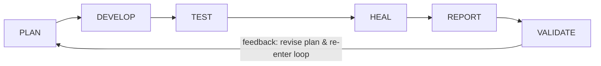
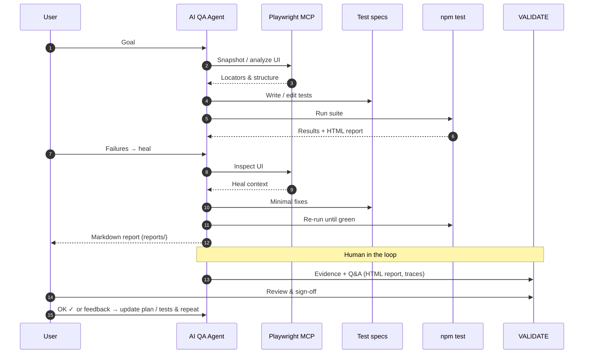
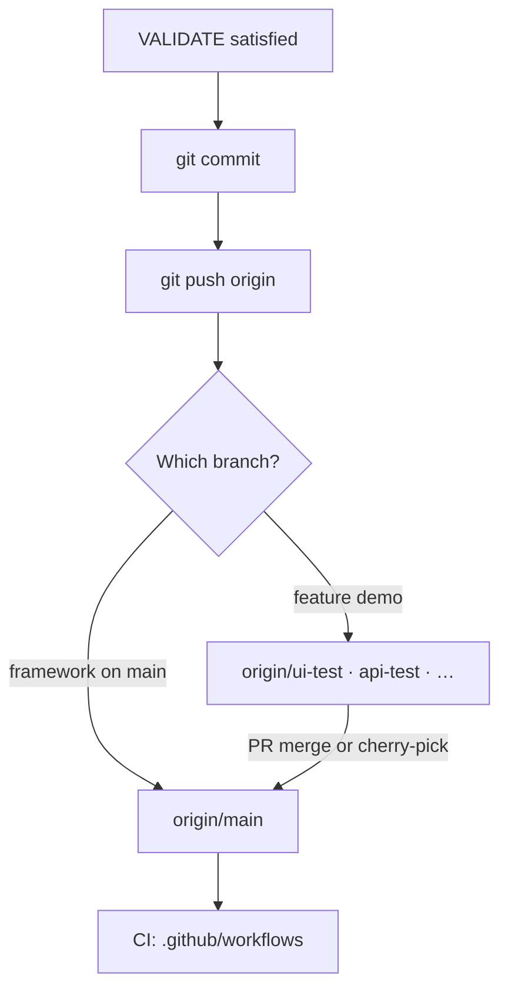
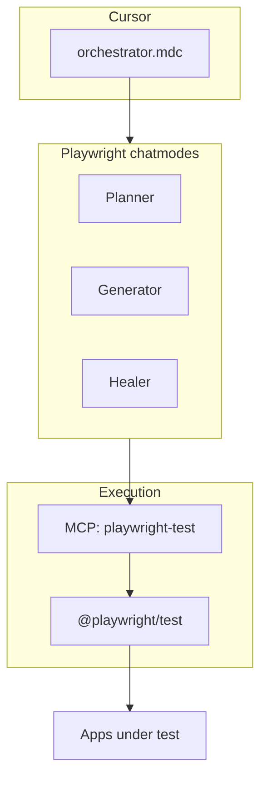
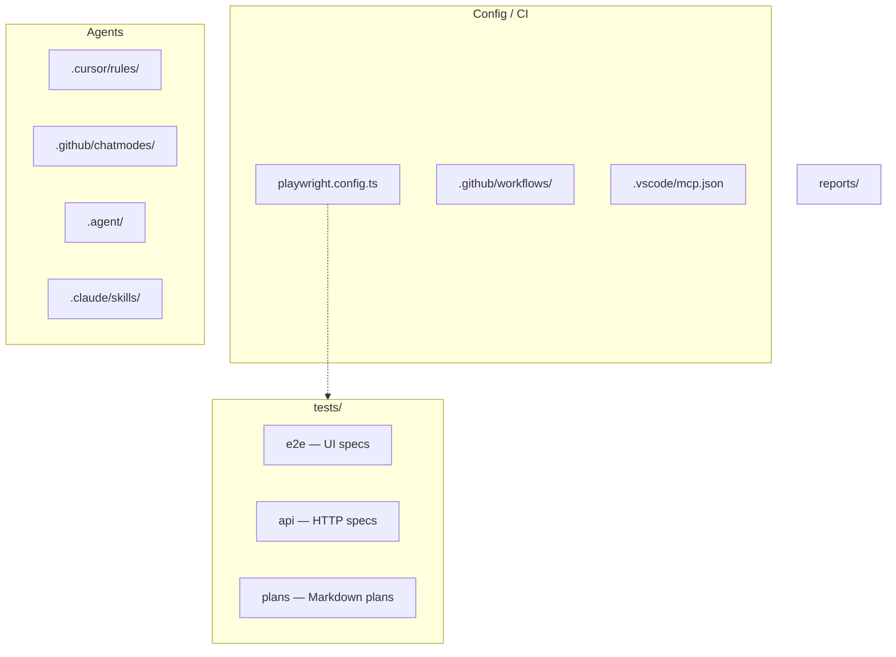

# AI QA Agent — Agentic QA (Cursor + Playwright)

[](https://github.com/loveautomate/ai-qa-agent/actions/workflows/playwright.yml)

Agent-driven **PLAN → DEVELOP → TEST → HEAL → REPORT → VALIDATE** using [Playwright Test](https://playwright.dev/docs/intro), **Planner / Generator / Healer** chatmodes (`.github/chatmodes/`), the [Playwright MCP](https://www.npmjs.com/package/@playwright/mcp), and Cursor rules (`.cursor/rules/orchestrator.mdc`).

**More detail:** [`AGENTS.md`](AGENTS.md) · [Product / roadmap](.agent/docs/prd.md)

**playwright-cli:** [docs](https://playwright.dev/docs/getting-started-cli) · skills in [`.claude/skills/playwright-cli/`](.claude/skills/playwright-cli/SKILL.md) · `npm run playwright-cli:skills`

---

## Architecture

### QA workflow

Forward pass plus **feedback**: when validation fails, scope changes, or the user is not satisfied, **update the plan** and run the loop again (see orchestrator **VALIDATE**).



### Sequence diagram (agentic loop + VALIDATE gate)

Interaction-level view: **VALIDATE** is its own step to the right of **`npm test`**; the human reviews evidence and signs off or sends feedback.



### Git: commit, push, and `main`

**Framework & CI** usually track **`main`**. **Demo-heavy work** (plans, specs, reports) often lives on **feature branches** (e.g. `ui-test`, `api-test`); merge or cherry-pick to `main` when promoting tooling-only changes.



### How pieces connect



### Repository map



---

## Demo targets

| Layer | Default base URL | Set in |
|-------|------------------|--------|
| UI e2e | [saucedemo.com](https://www.saucedemo.com/) | `DEMO_E2E_BASE_URL` |
| API | [petstore.swagger.io](https://petstore.swagger.io/) | `DEMO_API_BASE_URL` |

Change URLs in **`playwright.config.ts`** and keep **`tests/plans/*.md`** + specs in sync. Feature branches (e.g. `ui-test`, `api-test`) may carry extra demos; **`main`** stays a **framework harness** (see [`AGENTS.md`](AGENTS.md)).

## Demo video

[](https://www.youtube.com/watch?v=DmqQSG5dN4o)

---

## Use in Cursor

Example prompts:

- **"Run the AI QA Agent loop for saucedemo"**
- **"Plan → Generate → Test → Heal → Report → Validate petstore API"**
- **"VALIDATE — UI + API"**

The orchestrator drives: plan in `tests/plans/*.md` → tests in `tests/e2e/` or `tests/api/` → `npm test` → heal failures → `reports/*.md`. For **UI e2e validation**, start from **`npm run test:report`** (trace + video + HTML). **playwright-cli** is optional after that ([`.agent/skills/playwright-cli.md`](.agent/skills/playwright-cli.md)).

---

## Commands

```bash
npm install
npm test                 # UI e2e + API
npm run test:e2e         # Chromium, tests/e2e/
npm run test:api         # tests/api/
npm run test:smoke       # @smoke
npm run test:ci          # CI parity
```

Full UI evidence (trace, video, screenshots, HTML report):

```bash
npm run test:clean
npm run test:report
```

`npx playwright show-report` — reopen last HTML report.

---

## Playwright chatmodes

```bash
npx playwright init-agents --loop=vscode
```

| File | Role |
|------|------|
| `planner.chatmode.md` | Test planning |
| `generator.chatmode.md` | Spec generation |
| `healer.chatmode.md` | Failure recovery |

Regenerate after Playwright upgrades if you want upstream text; re-apply repo-specific edits.

---

## MCP in Cursor

Project file: **`.vscode/mcp.json`**. Server name must be **`playwright-test`** (tools like `playwright-test/browser_click`).

```json
{
  "mcpServers": {
    "playwright-test": {
      "command": "npx",
      "args": ["@playwright/mcp@latest"]
    }
  }
}
```

Pin `@playwright/mcp@…` instead of `@latest` for reproducibility. Global config: `~/.cursor/mcp.json` (Windows: `C:\Users\<you>\.cursor\mcp.json`). Troubleshooting: clear npx cache, restart Cursor (see [`AGENTS.md`](AGENTS.md)).

---

## Upgrade Playwright

1. `npm install @playwright/test@latest --save-dev`
2. `npx playwright install`
3. Optional: `npx playwright init-agents --loop=vscode` and diff chatmodes
4. Align `@playwright/mcp` with your Playwright version

---

## Roadmap

Status and improvements: **[`.agent/docs/prd.md`](.agent/docs/prd.md)** (*What could be improved in this agentic QA workflow*).
