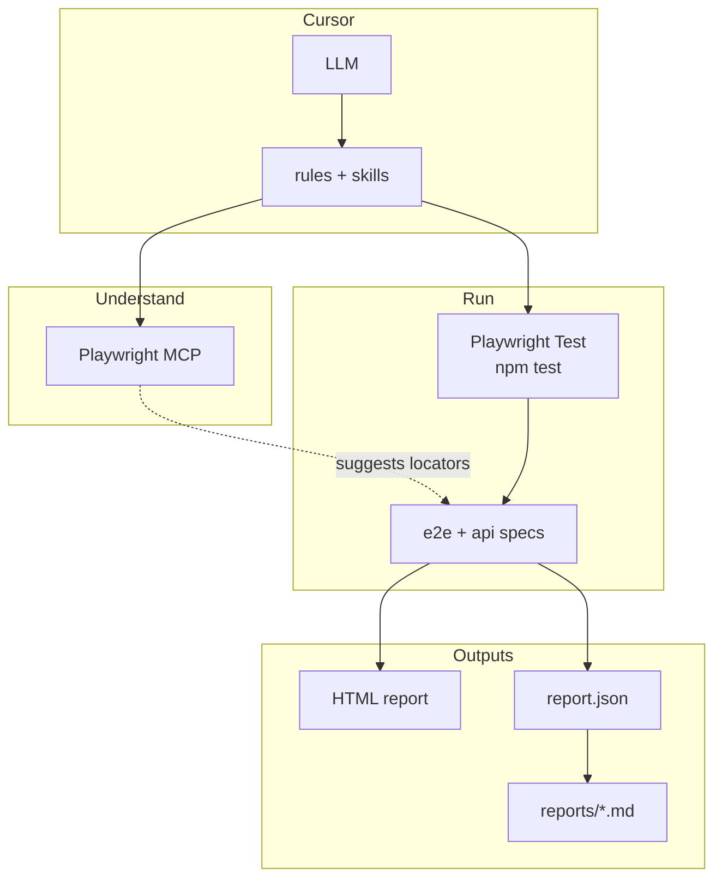
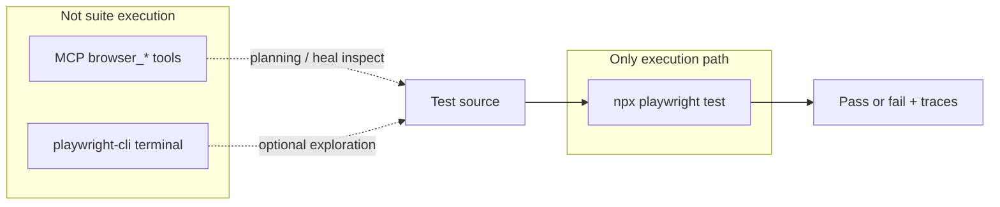
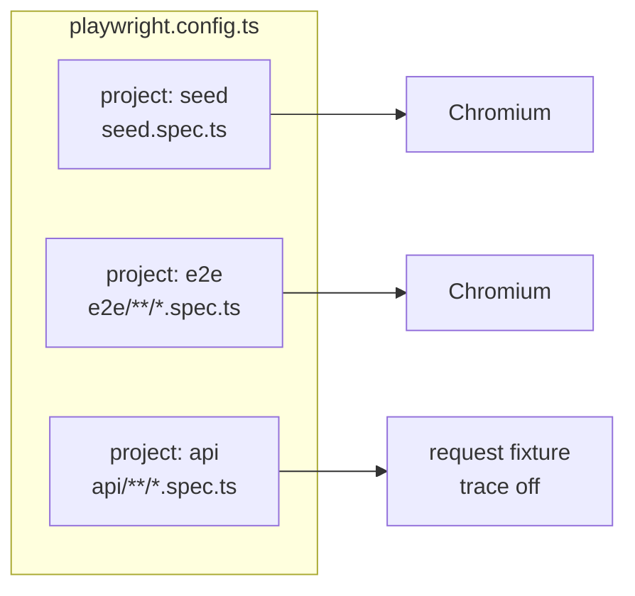
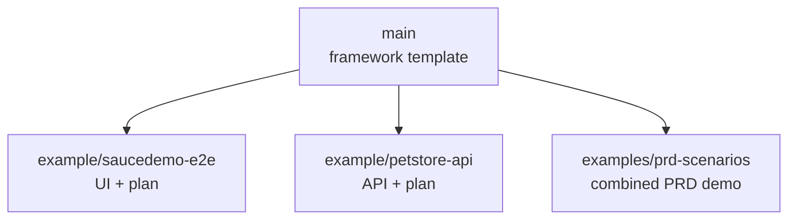

# Architecture diagrams

## 1. System layers (reasoning vs execution)

Separation of concerns: **understanding** (Playwright MCP in Cursor) vs **deterministic execution** (Playwright Test). Optional **`playwright-cli`** (terminal) is described in the README comparison table, not drawn here.

## 2. Tooling boundaries (what runs the suite)

## 3. Playwright Test projects

## 4. Repository branches (framework vs examples)

See [`BRANCHING.md`](../BRANCHING.md) for workflow commands.
