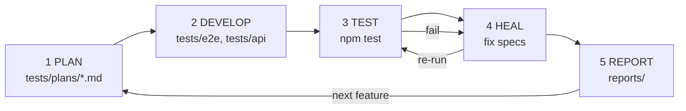
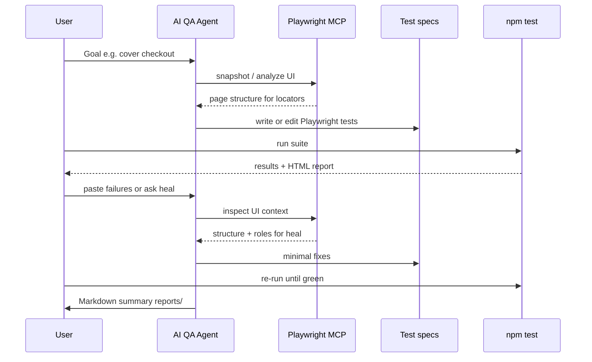
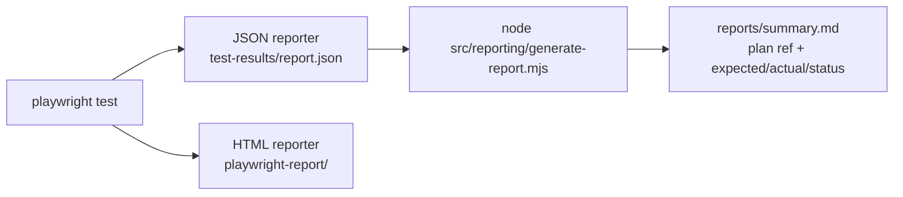
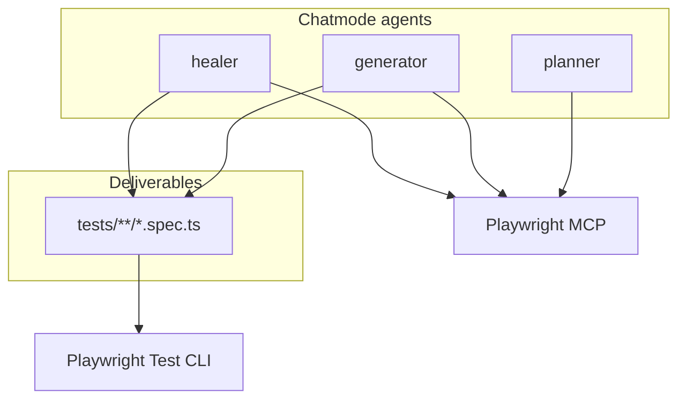

# Flow diagrams

## 1. Five-phase QA loop

Orchestrator phases from `.cursor/rules/00-orchestrator.mdc`.

## 2. Typical interaction (sequence)

Default loop: **MCP** (understanding) → **specs** → **`npm test`** (execution). For **MCP vs `playwright-cli` vs Playwright Test**, token tradeoffs, and when to use each, see the README section *MCP vs `playwright-cli` vs Playwright Test*.

## 3. Reporting pipeline

## 4. Chatmodes vs this repository

Upstream planner / generator / healer live under `.github/chatmodes/` (regenerate with `init-agents`). **Execution** of the suite is always **`npm test`**.

